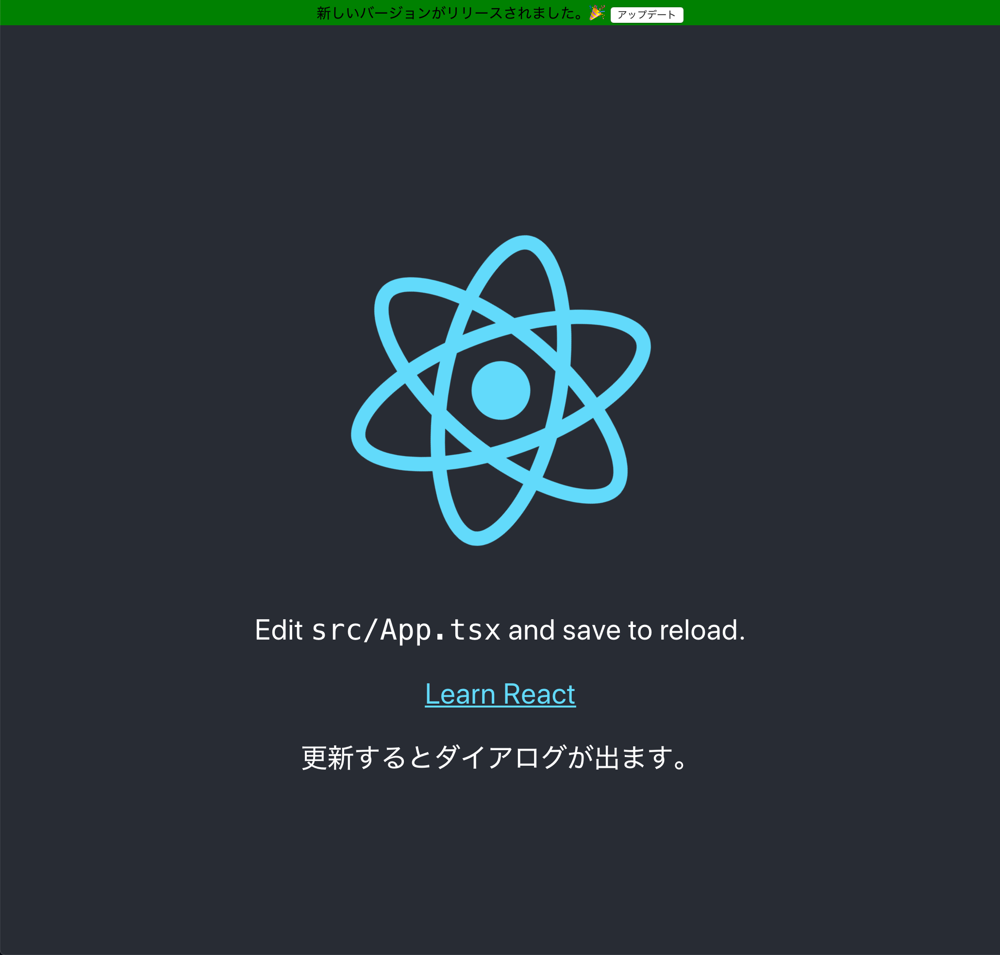

# create-react-app service worker update sample

create-react-app で作成した cache-first の PWA をアップデートするサンプル。

## Qiita

[create-react-appで作ったPWAでアップデートを検出して更新する](https://qiita.com/wakeupsloth/items/6778df1e984f55c446e9)

## Screenshot

